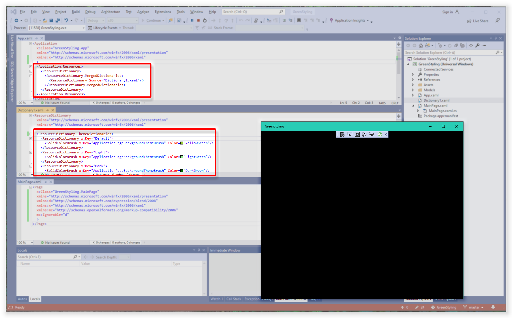

# UWP Inline Resource Issue

UWP documentation claims that styles can be applied to all of an app's pages by utilizing "[lightweight styling](https://docs.microsoft.com/windows/uwp/design/controls-and-patterns/xaml-styles#lightweight-styling)".

However, that doesn't seem work.

I created this repository to provide a reproducible project showing that lightweight styling does not apply a background color to `Page` components.

 

## Screenshot depicting the issue:

The `Page` should be rendered in **green**, but it's always rendered in **black**.